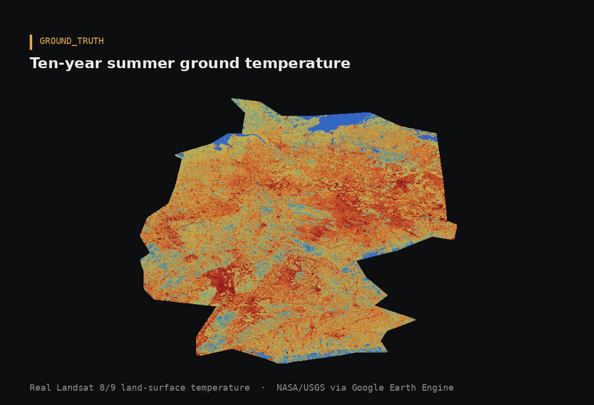
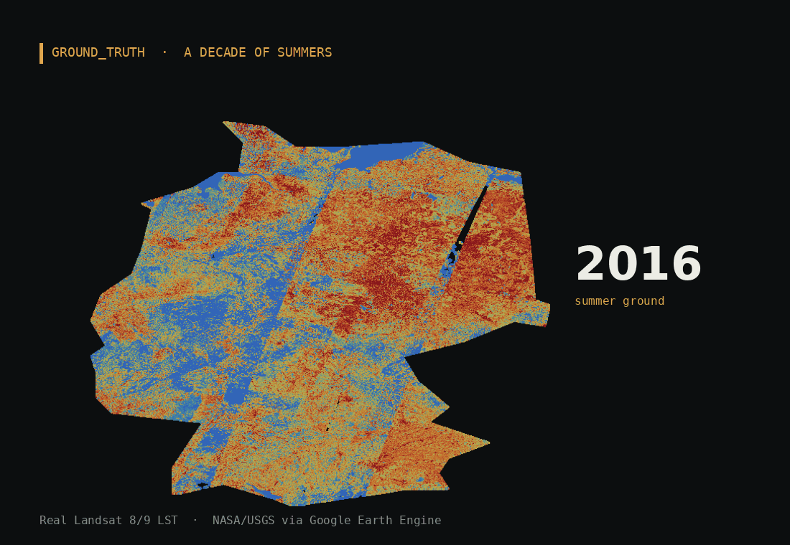

# Land surface temperature changes in Germany over the last ten years

**Satellite journalism, built from free Earth-observation data.**

A single scrollytelling map showing how Germany&rsquo;s summer ground temperature has changed across a decade &mdash; real Landsat thermal data, the urban heat-island, the measured warming rate, and how this summer compares to normal. No server, no login: one self-contained HTML page.

### 🔗 [**Open the live story →**](https://sanjusajimon220.github.io/land-surface-temperature-germany/)

---

## A look inside


*The ten-year summer ground temperature across Germany — real Landsat thermal data, national mean ≈ 29.2 °C.*

### A decade of summers


*Every summer from 2016 to 2026, measured from space. 2026 is a partial summer, labelled as such.*


---

## How it&rsquo;s built

```text
Landsat 8/9 thermal (band ST_B10, Google Earth Engine)
   └─► yearly + 10-yr-median summer LST GeoTIFFs, clipped to Germany
        └─► lst_tools : colour ramps · thin-seam gap-fill · per-pixel trend · city/state sampling
             └─► build_heat_story()  ─►  index.html   (the scrollytelling page)
```

Land-surface temperature is the temperature of the **ground itself** &mdash; roofs, roads, fields &mdash; not the air a weather station reads. It runs hotter than air temperature, which is exactly why it reveals where a city traps heat.

### The library (`lst_tools/`)

| Module | Purpose |
| --- | --- |
| `germany.py` | National bounding box, outline (for clipping), 18 major cities. |
| `germany_states.py` | Real boundaries + centroids for the 16 Bundesländer. |
| `surface.py` | Colour ramps (`HEAT_STOPS`, `ANOM_STOPS`), grid interpolation, thin-seam gap-fill, PNG rendering (with `max_px` downscaling for web). |
| `heat.py` | `grid_from_array` (click-to-read grid) + Landsat LST export helpers. |
| `forecast.py` | Per-pixel linear `lst_trend`, `lst_warming_rate`, `lst_project`, and `current_year_anomaly` (this-summer-vs-normal). |
| `story.py` | `build_heat_story()` &mdash; assembles the self-contained scrollytelling HTML. |

---

## Reproduce it

The full build runs in Google Colab (`notebook/GroundTruth_heat.ipynb`):

1. Export summer LST for Germany from Earth Engine (2016–2026 + 10-yr median).
2. Build the absolute, anomaly, time-lapse, warming-rate and projection layers.
3. `build_heat_story("index.html", …)` &rarr; publish.

```python
from lst_tools import build_heat_story
build_heat_story("index.html",
    heat_override=heat_override, heat_timelapse=heat_timelapse,
    forecast=forecast, city_series=city_series, current_year=current_year,
    title="Germany is heating up", byline="Ground_truth")
```

```bash
pip install -e .            # numpy, matplotlib, scipy
pip install -e ".[data]"    # + rasterio, earthengine-api  (to build from real tifs)
```

---

## Honest scope

This is a **screening view**, honest about its gaps &mdash; it shows where the ground runs hottest; it does **not** replace local measurement. Surface temperature ≠ air temperature. The 2026 figures are a **partial summer**, still unfolding, and are labelled as such; noisy partial-summer per-city values are filtered rather than published.

## Credits &amp; licence

Landsat 8/9 courtesy **NASA/USGS**, accessed via **Google Earth Engine**.
Analysis &amp; design © 2026 **Sanju Sajimon**. Code licensed **Apache-2.0**.
